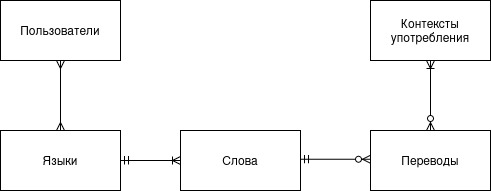
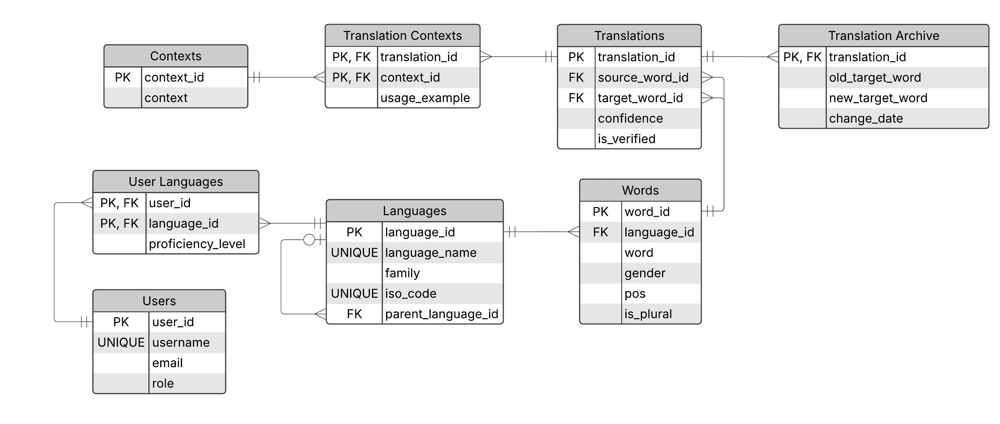

# 📖 LinguaCollect — Краудсорсинговый словарь языков и диалектов

## 📌 Описание проекта
**LinguaCollect** — это реляционная база данных для онлайн-словаря, направленного на работу с языками и их диалектами. 
Главная особенность — акцент на ручной ввод и проверку переводов носителями языков, а также работа с редкими и малоизвестными диалектами.

Система учитывает:
- версионирование переводов;
- уровни владения языками у пользователей;
- систему модерации переводов и их качества;
- грамматические характеристики слов;
- контексты употребления переводов.

---

## 🗂 Архитектура базы данных

- ✅ Нормализация до **3NF**
- ✅ Поддержка **SCD 4 версионности** переводов

---

## 🧠 Концептуальная модель

## 🗃 Логическая модель

## 💾 Физическая модель

## 📑 Основные таблицы
- **Users** — Пользователи системы с ролями
- **User Languages** — Связь "пользователь — язык" с уровнем владения
- **Languages** — Языки и диалекты (самореференция "язык — диалект")
- **Words** — Слова с морфологической информацией
- **Translations** — Переводы между словами со степенью качества и верификацией
- **Translation Archive** — История изменений переводов (SCD 4)
- **Contexts** — Контексты употребления для точного значения перевода
- **Translation Contexts** — Связь переводов с контекстами

## 📜 Автор проекта

Выполнил студент группы Б05-327 — Присталов Рустам